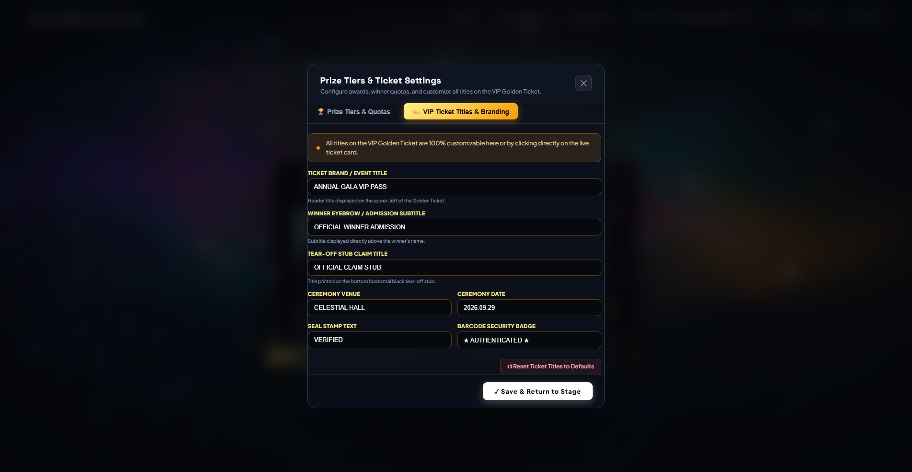
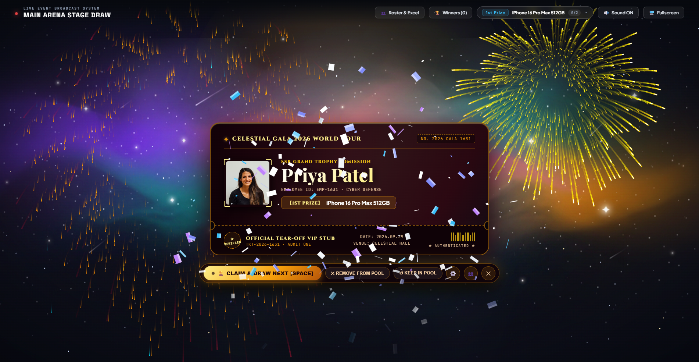

# 🎆 Celestial Firework Lucky Draw & VIP Golden Ticket Gala System
### 星穹烟花与金票盛典年会抽奖系统 · 企业大会级离线抽奖应用

[](https://opensource.org/licenses/MIT)
[-42b883.svg)](https://vuejs.org/)
[](https://developer.mozilla.org/en-US/docs/Web/API/Web_Audio_API)
[](https://sheetjs.com/)
[](#privacy)

---

## 🌟 项目亮点 (Key Highlights)

- **🎆 60 FPS 物理烟花双重画布引擎 (Pyrotechnic Dual-Canvas Engine)**  
  独立轨迹层与粒子爆炸层，真实模拟迫击炮点火引信、迫击炮底膛重低音、尖啸升空拖尾（Rocket Ascent）、空中顶点微重力减速与千丝垂柳（Kamuro Willows）重力衰减。
  
- **🔊 Web Audio API 程序化音频合成器 (Zero External Audio Files)**  
  彻底摆脱 MP3/WAV 音频文件加载慢或跨域问题，纯数学合成算法：粉红噪声引信燃烧声、正弦波下潜迫击炮冲击波、变频振荡器火箭尖啸、及白噪声多级爆鸣。

- **🎫 盛典级 VIP Golden Ticket（方案 B · 底部宽幅横向副券）**  
  酒红天鹅绒底蕴与暗金流光金箔边框，100% 国际化纯英文版式（Cinzel & Playfair Display），底部带有半圆形撕票缺口（Die-cut Notches）的横向副券，官方条形码与安全防伪印章。

- **✏️ 全要素标题实时可编辑 (100% Customizable Ceremony Titles)**  
  支持**表面直接点击原地修改（Inline Live Edit）**与**底栏 ⚙️ 设置弹窗批量配置**两种模式，自动持久化存储至浏览器本地 `localStorage`，刷新不丢失。

- **🛸 悬浮卫星胶囊坞 (Detached Satellite Capsule Dock)**  
  主操作按钮移出票券本体，独立悬浮于卡片下方。支持单人抽奖与多人批量抽奖、中奖者保留/移除候选池、快捷键（SPACE 键即时发射与认领）。

- **📊 100% 本地离线与数据隐私安全 (Local-First Architecture)**  
  内置离线版 SheetJS 引擎，支持直接拖拽 `.xlsx` / `.xls` / `.csv` 名单导入，支持批量文本粘贴同步，支持员工真实头像本地上传（Base64 转码），支持随时将中奖名单导出为标准 Excel 表格。

---

## 📸 运行效果截图 (Showcase)

| 🎆 盛典舞台烟花与 VIP Golden Ticket 中奖公布 |
| :---: |
|  |

| ⚙️ VIP 票券标题与品牌定制弹窗 | ✏️ 实时自定义标题生效演示 |
| :---: | :---: |
|  |  |

---

## 🚀 快速启动 (Quick Start)

本项目为 **100% 纯前端静态 + 轻量服务** 架构，无需配置复杂数据库。

### 方法一：双击一键启动（推荐 Windows 用户）
直接双击项目根目录下的 **`start.bat`** 或 `firework-edition/start.bat`，脚本将自动启动本地服务并打开浏览器。

### 方法二：命令行启动 (Node.js)
```bash
# 启动内置服务
node server.js

# 打开浏览器访问：
http://localhost:3001
```

---

## 🎮 操作指南与快捷键 (Controls & Shortcuts)

- **`SPACE` (空格键)**：点火发射火箭 / 抽取中奖者 / 确认领奖并抽下一位
- **`M` 键**：一键切换静音 / 开启盛典音效
- **`F` 键**：一键全屏 / 退出全屏（适合大屏幕与投影仪展播）
- **点击票券文字**：卡片上的活动名、日期、地点、副券标题等均可直接点击编辑修改
- **底栏 `⚙️` 图标**：打开奖项配额配置与金票全局文案定制面板
- **底栏 `👥` 图标**：打开候选人名单抽屉（查看名单、上传照片、导入 Excel）
- **顶栏 `🏆 Winners` 按钮**：查看已中奖者流水并一键导出为 Excel

---

## 📂 项目结构 (Directory Layout)

```
lucky draw/
├── firework-edition/           # 🎆 星穹烟花盛典独立完整版
│   ├── index.html              # 主应用界面 (Vue 3 挂载点)
│   ├── style.css               # 盛典视觉设计系统与 VIP Golden Ticket 样式
│   ├── app.js                  # 物理烟花引擎、Web Audio 合成器、状态管理
│   ├── vue.global.prod.js      # 离线 Vue 3 核心库
│   ├── xlsx.mini.min.js        # 离线 SheetJS Excel 导入导出库
│   ├── server.js               # 轻量级本地 HTTP 服务
│   ├── start.bat               # Windows 一键启动脚本
│   └── ticket_refinements.html # 票券形态对比与设计原型
├── requirements.md             # 产品功能规范
├── architecture.md             # 系统技术架构设计文档
└── README.md                   # 项目介绍文档
```

---

## 🔒 隐私与离线保证 (Privacy & Local-First)

- **零数据外发**：系统不需要联网即可完整运行，所有名单、工号、照片均在浏览器内存与本地存储中。
- **免数据库运维**：数据持久化使用浏览器的 `localStorage`，企业会议现场断网依然稳如磐石。

---

## 📄 授权协议 (License)

本项目采用 [MIT License](LICENSE) 授权许可。
