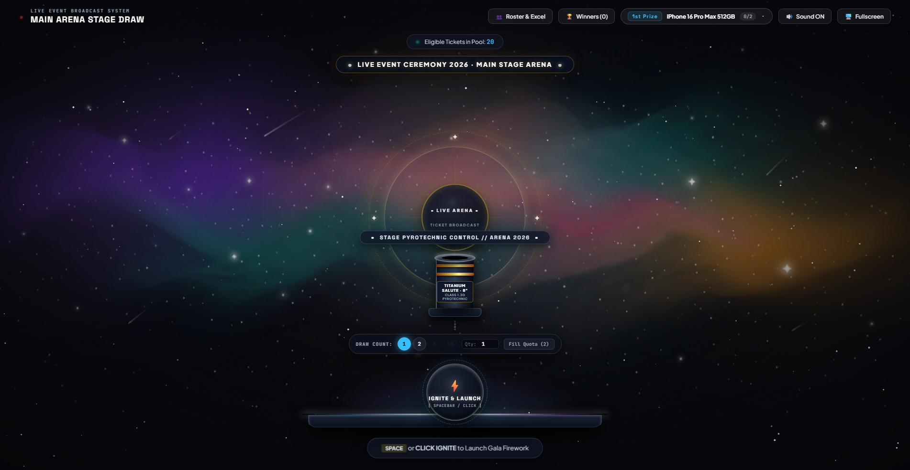
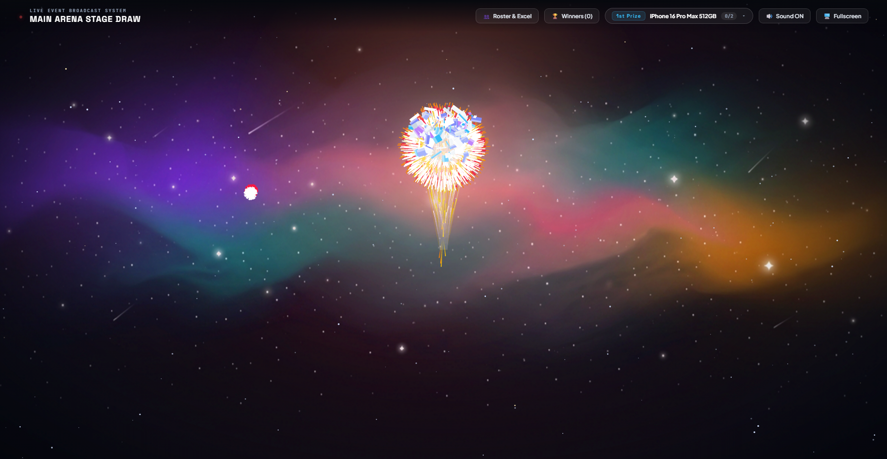
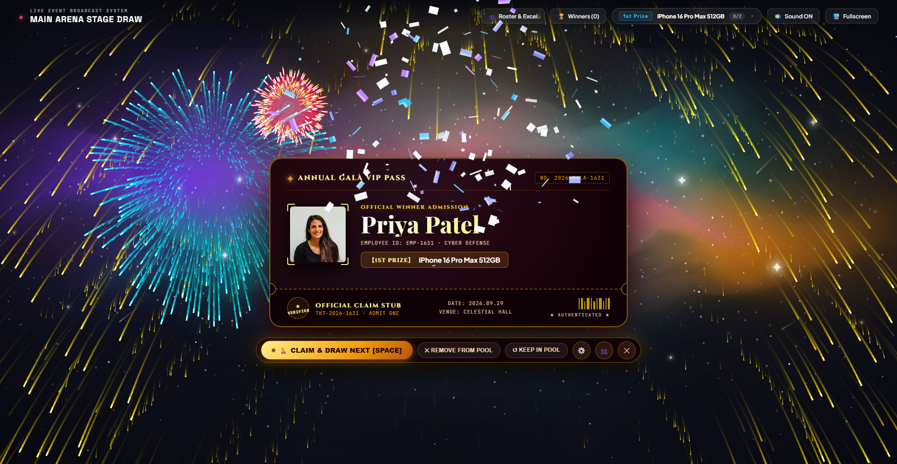
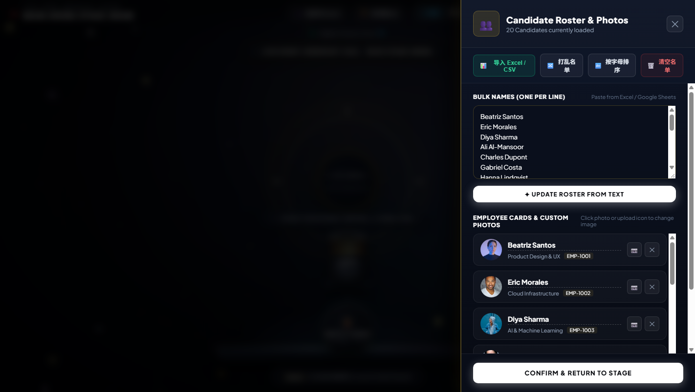

<div align="center">

# 🎆 Celestial Firework Lucky Draw & VIP Golden Ticket Gala System
### 星穹烟花与金票盛典年会抽奖系统 · 企业级高奢离线/在线双用抽奖平台

[](https://chenjunwei1230-dotcom.github.io/annual-gala-lucky-draw/)
[](https://github.com/chenjunwei1230-dotcom/annual-gala-lucky-draw)
[](LICENSE)
[-42b883?style=for-the-badge&logo=vuedotjs&logoColor=white)](https://vuejs.org/)
[](https://developer.mozilla.org/en-US/docs/Web/API/Web_Audio_API)
[](#privacy--local-first-guarantee)

<br>

**[English](#-english-documentation)** · **[简体中文](#-中文说明文档)**

</div>

---

<br>

# 🌐 Live Online Demo / 在线体验

> **No installation required! / 免下载安装，手机与电脑浏览器点开即用：**  
> 👉 **[https://chenjunwei1230-dotcom.github.io/annual-gala-lucky-draw/](https://chenjunwei1230-dotcom.github.io/annual-gala-lucky-draw/)**  
> *(Alternative mirror / 备用域名: `http://chenjunwei.me/annual-gala-lucky-draw/`)*

---

<br>

# 🇺🇸 English Documentation

## 🌟 Key Highlights

- **🎆 60 FPS Dual-Canvas Pyrotechnic Physics Engine**  
  Dedicated trajectory and explosion particle layers with real physical simulation: quickmatch ignition fuse, sub-bass mortar lift, soaring whistling ascent (Rocket Tail), micro-gravity apex deceleration, and trailing Kamuro Willow gravity drag.

- **🔊 Procedural Web Audio API Synthesizer (Zero External Audio Files)**  
  Pure mathematical DSP algorithms with zero MP3/WAV dependencies:
  - *Fuse Burning*: Bandpass-filtered pink noise
  - *Mortar Launch*: Exponential sine sub-bass drop (140Hz -> 38Hz)
  - *Ascent Screamer*: Frequency-modulated sawtooth whistling sweep
  - *Detonation Burst*: Multi-stage decaying white noise impact

- **🎫 Luxury VIP Golden Ticket Pass (Variant B · Horizontal Stub)**  
  Crimson velvet texture, metallic gold foil borders, 100% international gala English typography (*Cinzel* & *Playfair Display*), authentic semi-circular die-cut tear notches, official barcode, and security authentication stamps.

- **✏️ 100% User-Editable Titles (Dual-Channel Customization)**  
  Edit titles directly on the live ticket card (**Inline Live Edit** with dashed outline cues) or customize globally via the **Settings Modal (`⚙️`) Tab 2**. Automatically persisted to browser `localStorage`.

- **🛸 Detached Floating Satellite Capsule Dock**  
  Action buttons float gracefully beneath the ticket to preserve artwork integrity. Supports single and multi-winner batch draws, individual keep/discard pool options, and Spacebar rapid workflows.

- **📊 100% Local-First Architecture & Data Privacy**  
  Built-in offline SheetJS engine. Directly drag-and-drop `.xlsx` / `.csv` rosters with thousands of attendees, upload employee photos (converted to Base64 locally), and export verified winners history to Excel anytime. Zero server leakage.

---

## 📸 Visual Showcase & Effects

| 🌌 Live Gala Stage Arena (Idle) | 🎆 60 FPS Dual-Canvas Fireworks Burst |
| :---: | :---: |
|  |  |

| 🎫 VIP Golden Ticket Winner Reveal | ✏️ Direct Inline Live Title Editing |
| :---: | :---: |
|  |  |

| ⚙️ Prize Quota & Branding Settings Modal | 📊 Attendee Roster & Excel Import / Export |
| :---: | :---: |
|  |  |

---

## 🚀 Quick Start

### Option 1: One-Click Windows Launch
Double-click **`start.bat`** in the repository root. A lightweight local server will start and automatically launch your default browser.

### Option 2: Node.js Command Line
```bash
# Clone the repository
git clone https://github.com/chenjunwei1230-dotcom/annual-gala-lucky-draw.git
cd annual-gala-lucky-draw

# Run the lightweight zero-dependency server
node server.js

# Open in browser:
http://localhost:3001
```

---

## 🎮 Keyboard Shortcuts

| Shortcut | Description |
| :--- | :--- |
| **`SPACE`** | Launch firework rocket / Draw winner / Claim & draw next |
| **`M`** | Toggle procedural sound synthesizer (Mute / Sound ON) |
| **`F`** | Toggle Fullscreen mode (Optimal for projectors & LED walls) |
| **`ESC`** | Close open modals or side drawers |

---

<br>
<br>

---

# 🇨🇳 中文说明文档

## 🌟 核心功能亮点

- **🎆 60 FPS 物理级双重画布烟花粒子引擎 (Dual-Canvas Engine)**  
  独立轨迹层与粒子爆炸层，基于 HTML5 Canvas 实现迫击炮点火引信、空气阻力、微重力减速与千丝垂柳（Kamuro Willows）重力衰减。

- **🔊 Web Audio API 程序化音频合成器 (零外部音频文件)**  
  纯代码数学算法实时合成，彻底告别外部 MP3/WAV 加载卡顿、跨域或版权风险：
  - *引信燃烧*：粉红噪声 + 带通滤波调制
  - *迫击炮弹射*：低频正弦指数下潜冲击波（140Hz -> 38Hz）
  - *升空尖啸*：变频振荡器高频尖锐啸叫
  - *爆裂震鸣*：白噪声多级冲激衰减

- **🎫 盛典级 VIP Golden Ticket（方案 B · 底部宽幅横向副券）**  
  酒红天鹅绒底蕴与暗金流光金箔边框，100% 国际化纯英文版式（Cinzel & Playfair Display），底部带有半圆形撕票缺口（Die-cut Notches）的正向横向副券，官方条形码与安全防伪印章。

- **✏️ 全要素标题随时随地自定义编辑 (双通道编辑系统)**  
  - **通道一（卡面直改）**：鼠标轻触票券上的任何标题（如 `ANNUAL GALA VIP PASS`、`OFFICIAL CLAIM STUB`、日期场馆等），即可直接打字修改，失焦自动保存。
  - **通道二（设置面板）**：点击底栏 **`⚙️` 设置图标**，在专属标签页中统一修改所有文字，支持一键 `↺ Reset` 重置。

- **🛸 悬浮卫星胶囊坞 (Detached Satellite Capsule Dock)**  
  主操作按钮移出票券本体，独立悬浮于卡片下方。支持单人抽奖与多人批量抽奖、中奖者保留/移除候选池、快捷键（SPACE 键即时发射与认领）。

- **🔒 100% 离线与企业数据绝对隐私 (Local-First Architecture)**  
  内置离线版 SheetJS 引擎，直接拖入 Excel (`.xlsx` / `.csv`) 即可秒级导入数千人名单，支持员工真实头像上传（Base64 转码），支持随时将中奖名单导出为标准 Excel 表格。所有数据仅在浏览器本地运算，绝不上传第三方服务器。

---

## 🚀 离线运行方式

### 方式一：Windows 用户双击一键运行
直接双击根目录下的 **`start.bat`**，系统将自动启动轻量服务并弹出默认浏览器。

### 方式二：命令行极简启动
```bash
# 克隆代码仓库
git clone https://github.com/chenjunwei1230-dotcom/annual-gala-lucky-draw.git
cd annual-gala-lucky-draw

# 启动内置静态服务
node server.js

# 在浏览器中打开：
http://localhost:3001
```

---

## 🎮 键盘快捷键一览

| 快捷键 | 功能说明 |
| :--- | :--- |
| **`SPACE` (空格键)** | 发射烟花 / 抽取中奖者 / 确认领奖并抽下一位 |
| **`M` 键** | 一键开启 / 关闭全局背景盛典音效 |
| **`F` 键** | 一键切换全屏模式（适合大屏幕、投影仪展播） |
| **`ESC` 键** | 关闭当前打开的抽屉或弹窗 |

---

## 📂 项目结构规范 (Repository Structure)

```
annual-gala-lucky-draw/
├── index.html                 # 🎆 主应用入口界面 (Vue 3 挂载点)
├── style.css                  # 盛典视觉设计系统与 VIP Golden Ticket 样式
├── app.js                     # 物理烟花引擎、Web Audio 合成器、抽奖状态管理
├── vue.global.prod.js         # 离线 Vue 3 核心库
├── xlsx.mini.min.js           # 离线 SheetJS Excel 导入导出库
├── server.js                  # 轻量级本地 HTTP 服务 (零 npm 依赖)
├── start.bat                  # Windows 一键启动脚本
├── requirements.md            # 产品功能规范
├── architecture.md            # 系统技术架构设计文档
├── docs/
│   └── screenshots/           # 4K 高保真舞台实拍图集
├── LICENSE                    # MIT 开源协议
└── README.md                  # 中英双语项目介绍文档
```

---

## 📄 授权协议 (License)

本项目采用 [MIT License](LICENSE) 开源许可协议。欢迎自由分发、修改与商用。
